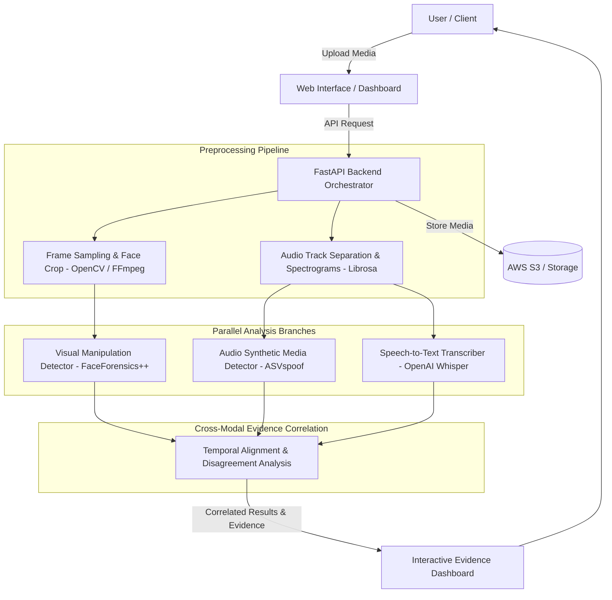

# DeepGuard AI 🛡️
### Multimodal Synthetic Media and Deepfake Detection Platform

---

## 📌 Project Overview

**DeepGuard AI** is a research-oriented, multimodal media analysis platform designed to detect and investigate manipulated or AI-generated video and audio content. 

Unlike black-box commercial tools that output an opaque authenticity score without contextual explanations, **DeepGuard AI introduces a transparent multimodal evidence-correlation approach**. The platform inspects visual artifacts, acoustic spoof signals, and transcribed speech across a synchronized timeline, keeping modality-specific evidence visible so users can understand *where*, *when*, and *why* manipulation is suspected.

---

## 🎯 The Problem & Proposed Contribution

Modern generative AI tools can forge human likenesses with high realism. A malicious synthetic video may contain:
- A genuine video track with a **voice-cloned audio track**.
- An authentic audio track with a **deepfake face-swap**.
- Completely synthetic audio-visual content.

Traditional unimodal detectors often fail when only one dimension of media has been tampered with. DeepGuard AI solves this by:
1. **Separating Analysis Branches**: Video frames, acoustic spectrograms, and speech transcripts are processed through dedicated specialized models.
2. **Exposing Modality Evidence**: Individual scores, Mel-spectrograms, and suspicious video frames are preserved rather than collapsed into a single mystery number.
3. **Cross-Modal Disagreement Detection**: Explicitly detecting inconsistencies between branches (e.g., visual analysis indicates authentic video while audio indicates synthetic speech).
4. **Temporal Evidence Alignment**: Pinpointing exact timestamps where anomalies are observed.

---

## 🏗️ System Architecture

---

## 👥 Team Members & Responsibilities

| Team Member | Primary Responsibility | Key Deliverables |
| :--- | :--- | :--- |
| **Mohan Abhishek Gupta** | **Cloud & System Architecture (Lead)** | Cloud infrastructure, AWS S3 storage, FastAPI backend orchestrator, API schemas, and deployment. |
| **Tunga Durga Sai Prasad** | **ML / Computer Vision** | Frame extraction, face detection, visual deepfake model experiments, and visual evidence generation. |
| **Harsha Paladi** | **Audio Machine Learning** | Audio extraction, acoustic representation, Mel-spectrograms, and synthetic speech detector. |
| **Vinay Rayi** | **Speech / NLP** | OpenAI Whisper ASR integration, speech transcription, and textual contextual analysis. |
| **Bikesh** | **Data Pipeline & ML Evaluation** | Dataset curation, benchmarking (Precision, Recall, F1, Confusion Matrix), and ablation studies. |
| **Harsha** | **Full Stack & Dashboard** | Next.js/React frontend, media upload workflow, interactive evidence dashboard, and timeline UI. |

---

## 🛠️ Technology Stack

| Layer | Technologies |
| :--- | :--- |
| **Frontend UI** | Next.js / React, TailwindCSS, Lucide Icons, Wavesurfer.js |
| **Backend API** | Python, FastAPI, Uvicorn, Pydantic |
| **Computer Vision** | OpenCV, FFmpeg, PyTorch, Pretrained Deepfake Detectors |
| **Audio & Speech** | Librosa, PyTorch Audio, OpenAI Whisper |
| **Evaluation Data** | FaceForensics++, ASVspoof 2021 Benchmark Datasets |
| **Cloud & DevOps** | AWS S3, Docker, Git & GitHub |

---

## 📅 Project Roadmap

- [x] **Phase 1**: Project topic submission, architecture design, and repository setup.
- [ ] **Phase 2**: Media upload flow, validation, and preprocessing pipelines.
- [ ] **Phase 3**: Visual analysis baseline model implementation.
- [ ] **Phase 4**: Audio synthetic-speech baseline model implementation.
- [ ] **Phase 5**: Speech-to-text integration and supporting transcript generation.
- [ ] **Phase 6**: Cross-modal correlation layer and disagreement detection logic.
- [ ] **Phase 7**: Evidence dashboard integration and cloud deployment.
- [ ] **Phase 8**: Quantitative evaluation, ablation experiments, and error analysis.
- [ ] **Phase 9**: Final demonstration, documentation, and research presentation.

---

## ⚖️ Academic Disclaimer & Responsible Use

DeepGuard AI is an academic research prototype intended for experimental evaluation and educational demonstration. Detection outputs represent probabilistic model estimates under tested conditions and are not presented as legally conclusive forensic evidence.
